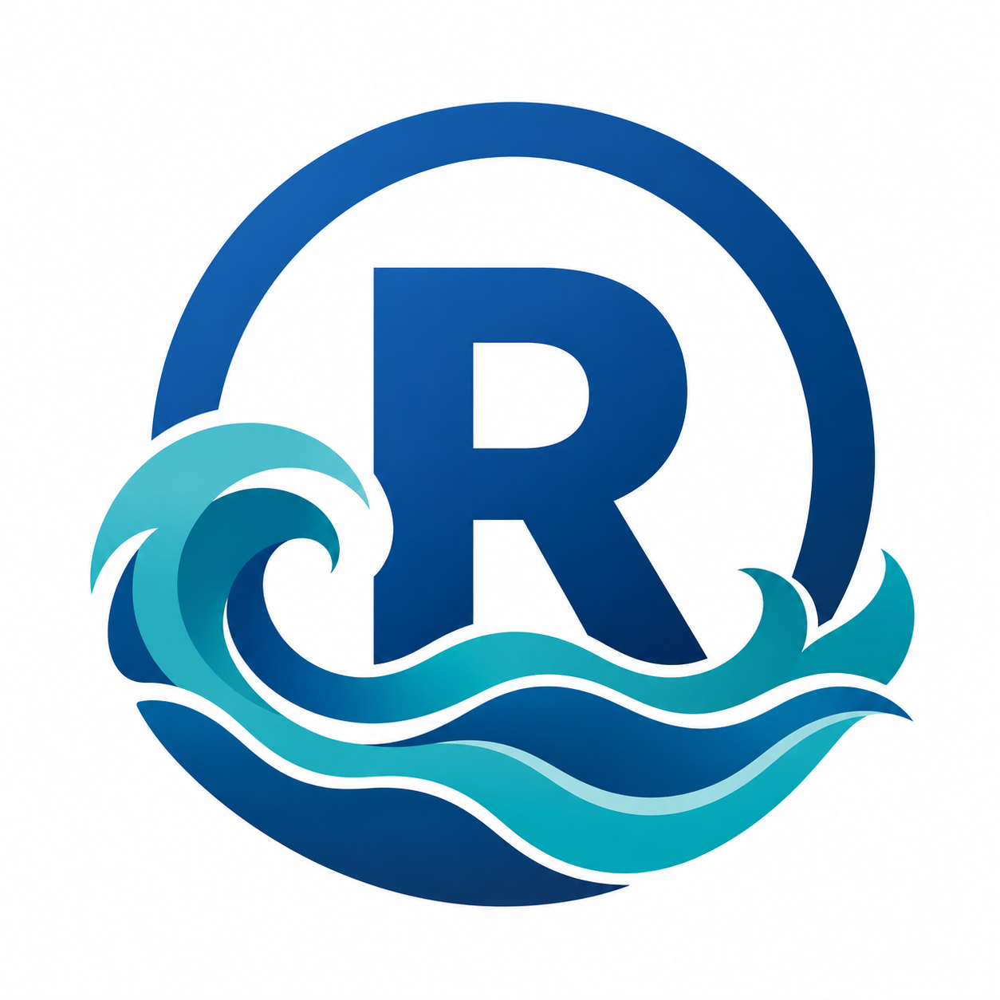

<!-- Hero -->
::: {style="text-align: center; padding: 3rem 0 2rem 0;"}
# {width=100px} R-Tide

**A community where R users learn together, share discoveries, and grow alongside the R ecosystem.**

Whether you're new to R or a seasoned developer — you belong here.
:::

---

<!-- Why -->
::: {style="background-color: #f8f9fa; padding: 2.5rem; border-radius: 12px; margin: 2rem 0;"}
The R ecosystem moves fast. New packages, evolving tools, endless possibilities.

**Keeping up alone is exhausting. Keeping up together is exciting.**

R-Tide exists so that when one of us learns something new, we all move forward.
:::

---

## Mission & Vision

::: {.grid}
::: {.g-col-6}
::: {.callout-tip collapse="false" appearance="simple"}
## Mission
Build a space where R users of every level learn together, share openly, and support one another.
:::
:::

::: {.g-col-6}
::: {.callout-note collapse="false" appearance="simple" icon="false"}
## Vision
Every R user — beginner or expert — feels connected, supported, and excited to keep learning.
:::
:::
:::

---

## What We Believe

::: {style="display: grid; grid-template-columns: repeat(auto-fit, minmax(200px, 1fr)); gap: 1.5rem; margin: 1.5rem 0;"}
::: {style="background: #e8f4f8; padding: 1.5rem; border-radius: 10px; text-align: center;"}
**Learning is collaborative.**
Questions are welcome. Discoveries are shared.
:::

::: {style="background: #e8f4f8; padding: 1.5rem; border-radius: 10px; text-align: center;"}
**Everyone contributes.**
Students, analysts, developers, educators — all have something to offer.
:::

::: {style="background: #e8f4f8; padding: 1.5rem; border-radius: 10px; text-align: center;"}
**We rise together.**
When the tide comes in, it lifts every boat.
:::

::: {style="background: #e8f4f8; padding: 1.5rem; border-radius: 10px; text-align: center;"}
**R stays accessible.**
As the ecosystem grows, we help each other understand what's new and why it matters.
:::
:::

---

## Who Is R-Tide For?

::: {style="display: grid; grid-template-columns: repeat(auto-fit, minmax(220px, 1fr)); gap: 1rem; margin: 1.5rem 0;"}
::: {style="background: #f8f9fa; padding: 1.2rem; border-radius: 8px; border-left: 4px solid #2A9D8F;"}
**Data Analysts & Scientists**
New packages and best practices, together.
:::

::: {style="background: #f8f9fa; padding: 1.2rem; border-radius: 8px; border-left: 4px solid #1A3A5C;"}
**Shiny Developers**
Features, deployment tips, and app inspiration.
:::

::: {style="background: #f8f9fa; padding: 1.2rem; border-radius: 8px; border-left: 4px solid #00B4D8;"}
**Quarto Users**
Publishing workflows, formats, and design ideas.
:::

::: {style="background: #f8f9fa; padding: 1.2rem; border-radius: 8px; border-left: 4px solid #E76F51;"}
**Educators & Researchers**
Tools and resources shared across disciplines.
:::

::: {style="background: #f8f9fa; padding: 1.2rem; border-radius: 8px; border-left: 4px solid #6C5B7B;"}
**Students**
A supportive community to find your footing in R.
:::

::: {style="background: #f8f9fa; padding: 1.2rem; border-radius: 8px; border-left: 4px solid #F4A261;"}
**Community Leaders**
Connect with groups strengthening R worldwide.
:::
:::

---

## How R-Tide Works

::: {style="display: grid; grid-template-columns: repeat(auto-fit, minmax(250px, 1fr)); gap: 1.5rem; margin: 1.5rem 0;"}
::: {style="text-align: center; padding: 1.5rem; background: linear-gradient(135deg, #e8f4f8 0%, #d1ecf1 100%); border-radius: 12px;"}
### Continuous Learning
Regular content covering R for analysis, Shiny for dashboards, and Quarto for publishing.
:::

::: {style="text-align: center; padding: 1.5rem; background: linear-gradient(135deg, #e8f4f8 0%, #d1ecf1 100%); border-radius: 12px;"}
### Community-Powered
**Guest curators · Tide Watchers · Open discussions.**
Everyone can participate and contribute.
:::
:::

---

## Get in Touch

::: {style="text-align: center; padding: 2rem; background-color: #f8f9fa; border-radius: 12px; margin: 2rem 0;"}
Have a question, want to contribute, or just want to say hello?

**We'd love to hear from you.**

📧 [rtidecommunity@gmail.com](mailto:rtidecommunity@gmail.com)
:::

---

::: {style="text-align: center; padding: 2rem 0 1.5rem 0; color: #6c757d;"}
**Stay curious. Stay connected. Ride the tide together.**

*— The R-Tide Community*
:::